## Diagramas

- [Sequence](#sequence)
- [Flow](#flow)
- [Events](#events-create)
- [Events](#events-change)

### Sequence
Diagrama de sequência lógica do [front-end](https://jonathanapaes.github.io/Software-Product/views/static/funcionario.html)

### Flow
Diagrama referente a interação do usuário

### Events - Create
Diagrama referente aos [Eventos](https://jonathanapaes.github.io/Software-Product/views/static/src/js/funcionario/events.js)

### Events - Change
Diagrama referente aos [Eventos](https://jonathanapaes.github.io/Software-Product/views/static/src/js/funcionario/events.js)

